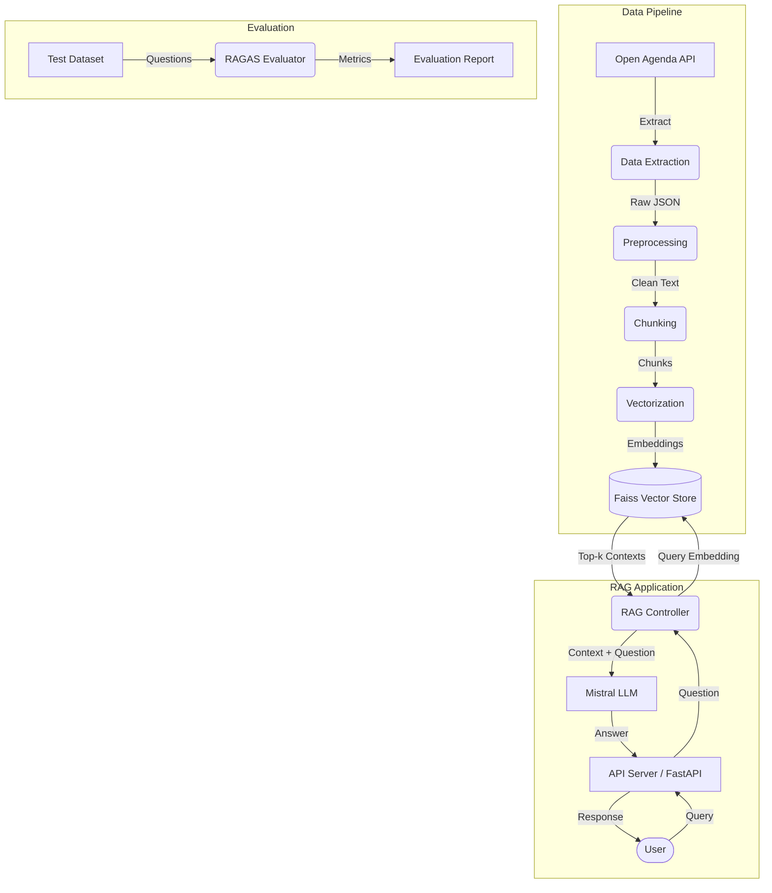

# PULS Events RAG - Cultural Event Recommendation Chatbot

 **Production-ready Retrieval-Augmented Generation (RAG) pipeline for discovering cultural events in Paris**

## Mission

Build a chatbot that enables natural language discovery of cultural events using:
- **Real-time data** from Open Agenda API (1,500-3,000 Paris events)
- **Semantic search** with Faiss vector database (sub-second retrieval)
- **Contextual generation** with Mistral 7B LLM (accurate recommendations)

## Features

-  **Natural Language Queries**: "Jazz concerts this weekend near Montmartre"
-  **Temporal Awareness**: Automatically filters past events, prioritizes upcoming
-  **Multi-Criteria Matching**: Location, category, date, keywords
-  **Source Attribution**: Every recommendation includes event metadata
-  **REST API**: Production-ready FastAPI service with OpenAPI docs
-  **Docker Ready**: Containerized deployment with health checks

## Dataset

**Source**: Open Agenda API (OpenDataSoft endpoint)  
**Geographic Focus**: Paris & Île-de-France  
**Temporal Scope**: Last 12 months + upcoming events  
**Volume**: 1,500-3,000 events → 3,000-6,000 text chunks  
**Format**: JSON records with title, description, location, dates, keywords

**API Endpoint**:
```
https://public.opendatasoft.com/api/records/1.0/search/?dataset=evenements-publics-openagenda
```

## Architecture

```
┌─────────────┐    ┌──────────────┐    ┌─────────────┐    ┌──────────┐
│ Open Agenda │ -> │ Preprocessing│ -> │ Vectorization│ -> │  Faiss   │
│     API     │    │  & Chunking  │    │ (HuggingFace)│    │  Index   │
└─────────────┘    └──────────────┘    └─────────────┘    └──────────┘
                                                                  |
                                                                  v
┌─────────────┐    ┌──────────────┐    ┌─────────────┐    ┌──────────┐
│   User      │ -> │   FastAPI    │ -> │ RAG Pipeline│ -> │ Mistral  │
│   Query     │    │   Endpoint   │    │   (Retrieve │    │   LLM    │
└─────────────┘    └──────────────┘    │  + Generate)│    └──────────┘
                                        └─────────────┘
```
### High-Level Architecture (UML)




## Quick Start

### API Key

1.    Go to https://console.mistral.ai/
2.    Create an account or log in
3.    Navigate to "API Keys"
4.    Click "Create new key"
5.    Copy the key (starts with mist_...)


### Installation

```bash
poetry install
poetry env activate

cp env-example.txt .env
# Edit .env and add your MISTRAL_API_KEY

poetry run python -m ipykernel install --user --name=puls-events-rag --display-name="Python (puls-events-rag)"

poetry run jupyter notebook
```
:D


## Step-by-Step Execution Guide

### Modules


**data_extraction.py**
* Contains the OpenAgendaExtractor class
* Handles API calls to Open Agenda

**preprocessing.py**
* Contains the EventPreprocessor class
* Cleans HTML, normalizes text into chunks manageable pieces

### Data Extraction & Preprocessing (15-25 minutes)

**Notebook**: `notebooks/01_data_extraction_preprocessing.ipynb`

**Purpose**: Extract events from Open Agenda API and prepare for vectorization

**Activities**:
1. Connect to Open Agenda API and extract 1,500-3,000 Paris events
2. Exploratory data analysis (event categories, dates, locations)
3. Text preprocessing (HTML removal, normalization, cleaning)
4. Chunk descriptions (256-512 tokens, 50% overlap)
5. Validate data quality and save processed dataset

**Outputs**:
- `data/raw/events_raw.json` (1,500-3,000 events, ~15-30 MB)
- `data/processed/events_processed.json` (3,000-6,000 chunks, ~20-40 MB)
- Data quality report and visualizations

**Verification**:
```bash
python -c "import json; print(f'{len(json.load(open(\"data/raw/events_raw.json\")))} events extracted')"
```

### Vectorization & Faiss Indexing (20-35 minutes)

**Notebook**: `notebooks/02_vectorization_faiss_indexing.ipynb`

**Purpose**: Convert text to embeddings and build Faiss vector index

**Activities**:
1. Load preprocessed chunks
2. Generate 384-dimensional embeddings (multilingual MPNET model)
3. Apply PCA dimensionality analysis
4. Build Faiss IVFFlat index (nlist=100, nprobe=10)
5. Test retrieval quality with sample queries
6. Save index and metadata to disk

**Outputs**:
- `faiss_index/events.index` (150-250 MB binary)
- `faiss_index/metadata.pkl` (10-20 MB pickle)
- `faiss_index/config.json` (index parameters)
- Performance metrics (latency, recall@5, recall@10)

**Verification**:
```bash
python -c "import faiss; idx = faiss.read_index('faiss_index/events.index'); print(f'✓ Index contains {idx.ntotal} vectors')"
```

###  RAG Pipeline, API & Evaluation 

**Notebook**: `notebooks/03_rag_api_evaluation.ipynb`

**Purpose**: Build RAG chatbot, expose REST API, and evaluate quality

**Activities**:
1. Implement RAG system (retrieve + generate)
2. Create FastAPI application (`POST /ask`, `GET /health`)
3. Design system and user prompts
4. Annotate test dataset (30-50 question-answer pairs)
5. Evaluate with metrics (BLEU, semantic similarity, Exact Match)
6. Generate evaluation report with error analysis

**Outputs**:
- `scripts/rag_system.py` (production RAG class)
- `scripts/api_server.py` (FastAPI application)
- `data/test/test_dataset_annotated.json` (test cases)
- `results/evaluation_results.json` (metrics + analysis)
- `tests/test_api.py` (API tests)

**Start API Server**:
```bash
poetry run uvicorn scripts.api_server:app --host 0.0.0.0 --port 8000
```

**Test API**:
```bash
# Health check
curl http://localhost:8000/health

# Query events
curl -X POST http://localhost:8000/ask \
  -H "Content-Type: application/json" \
  -d '{"question": "Jazz concerts this Friday?"}'

# Rebuild Index (Admin)
curl -X POST http://localhost:8000/rebuild
```

## Project Structure

```
puls-events-rag/
├── README.md                          # This file
├── pyproject.toml                     # Poetry dependencies
├── .env                               # Environment variables (gitignored)
├── .env.example                       # Environment template
│
├── notebooks/                         # Jupyter notebooks (execution order)
│   ├── 01_data_extraction_preprocessing.ipynb
│   ├── 02_vectorization_faiss_indexing.ipynb
│
├── scripts/                           # Production Python modules
│   ├── __init__.py
│   ├── data_extraction.py            # Open Agenda API client
│   ├── preprocessing.py              # Text cleaning & chunking
│   ├── vectorization.py              # Embedding generation
│   ├── rag_system.py                 # RAG chatbot class
│   ├── api_server.py                 # FastAPI application
│   └── evaluate_rag.py               # Evaluation pipeline
│
├── data/                              # Data storage
│   ├── raw/events_raw.json           # Original API responses
│   ├── processed/events_processed.json # Cleaned chunks
│   └── test/test_dataset_annotated.json # Test cases
│
├── faiss_index/                       # Vector database
│   ├── events.index                  # Faiss binary index
│   ├── metadata.pkl                  # Chunk metadata
│   └── config.json                   # Index configuration
│
├── results/                           # Evaluation outputs
│   ├── evaluation_results.json       # Metrics & analysis
│   └── error_analysis.csv            # Failed queries
│
├── tests/                             # Unit & integration tests
│   ├── test_preprocessing.py
│   ├── test_vectorization.py
│   ├── test_rag_system.py
│   └── test_api.py
│
└── docker/                            # Docker configuration
    ├── Dockerfile
    ├── docker-compose.yml
    └── .dockerignore
```

## 🔧 Technology Stack

| Component | Technology | Purpose |
|-----------|-----------|---------|
| **Orchestration** | LangChain | RAG pipeline coordination |
| **Vector Store** | Faiss | Efficient similarity search |
| **Embeddings** | HuggingFace Transformers | Text vectorization (384-dim) |
| **LLM** | Mistral AI API | Response generation |
| **API Framework** | FastAPI | REST API server |
| **Server** | Uvicorn | ASGI production server |
| **Dependency Mgmt** | Poetry | Python packaging |
| **Containerization** | Docker | Production deployment |


## 🐳 Docker Deployment

### Build and Run

```bash
# Build image
docker build -t puls-events-rag:latest .

# Run container
docker run -d \
  --name rag-api \
  -p 8000:8000 \
  -e MISTRAL_API_KEY=$MISTRAL_API_KEY \
  puls-events-rag:latest

# Check logs
docker logs -f rag-api

# Test health
curl http://localhost:8000/health
```

### Docker Compose

```bash
# Start services
docker-compose up -d

# View logs
docker-compose logs -f

# Stop services
docker-compose down
```

## Testing

```bash
# Run all tests
poetry run pytest

# Run with coverage
poetry run pytest --cov=scripts --cov-report=html

# Run specific test file
poetry run pytest tests/test_api.py -v

# Run evaluation
poetry run python scripts/evaluate_rag.py --test-data data/test/test_dataset_annotated.json
```

## API Usage Examples

### Python Client

```python
import requests

def ask_events(question: str) -> dict:
    response = requests.post(
        "http://localhost:8000/ask",
        json={"question": question},
        timeout=10
    )
    return response.json()

# Usage
result = ask_events("Free art exhibitions this weekend?")
print(result["answer"])
for source in result["sources"]:
    print(f"- {source['title']}: {source['link']}")
```

### curl Examples

```bash
# Specific query
curl -X POST http://localhost:8000/ask \
  -H "Content-Type: application/json" \
  -d '{"question": "Jazz concerts in Le Marais this Friday?"}'

# Vague query
curl -X POST http://localhost:8000/ask \
  -H "Content-Type: application/json" \
  -d '{"question": "Something fun to do this weekend?"}'

# With specific criteria
curl -X POST http://localhost:8000/ask \
  -H "Content-Type: application/json" \
  -d '{"question": "Free outdoor events for families?"}'
```

### OpenAPI Documentation

Access interactive API docs at:
- Swagger UI: http://localhost:8000/docs
- ReDoc: http://localhost:8000/redoc

## 🛠️ Troubleshooting

### Common Issues

**Python 3.12 Compatibility**
```bash
# Use Python 3.10 or 3.11
pyenv install 3.11.7
pyenv local 3.11.7
poetry env use 3.11.7
poetry install
```

**Mistral API Authentication**
```bash
# Verify API key in .env
cat .env | grep MISTRAL_API_KEY
# Regenerate at https://console.mistral.ai/api-keys
```

**Out of Memory During Embedding**
```python
# Reduce batch size in notebook 02
batch_size = 16  # Instead of 32
```

**Slow Retrieval**
```python
# Increase nprobe for better recall
faiss_index.nprobe = 20  # Instead of 10
```

### Performance Optimization

- **GPU Acceleration**: Install `faiss-gpu` instead of `faiss-cpu`
- **Caching**: Add Redis cache for frequent queries
- **Batch Processing**: Use async/await for concurrent API calls
- **Index Optimization**: Use scalar quantization for lower memory


## License

This project is licensed under the MIT License 

## Contributors

- **Iyed Jaziri** - Project lead


## Ressources

- Open Agenda for providing cultural event data
- Meta AI for Faiss vector search library
- Mistral AI for LLM API
- HuggingFace for embedding models
- LangChain for RAG framework

---